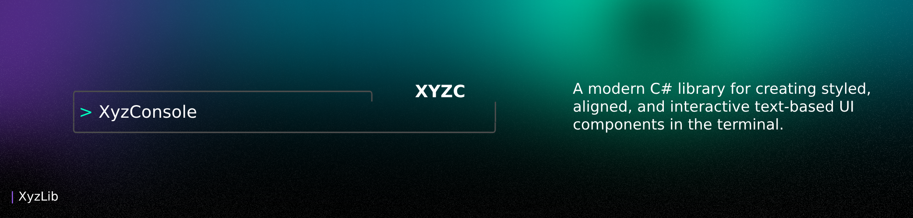

<p align="center">
    <a href="https://github.com/ayu-6/XYZC/blob/main/LICENSE"></a>
</p>

## 📦 Installation

XYZC will be available on NuGet soon. For now, you can install it by cloning the repository.

```bash
# Coming soon to NuGet!
```

## 🚀 Usage

Here's a quick example of how to create a styled label:

```csharp
using XYZC.Components;
using XYZC.Core;

// Simple centered label with color
new Label("Hello, [color cyan]XYZC[color reset]!")
{
    TextAlign = TextAlign.Center
}.Draw();
```

For more complex UIs, you can use a `ConsoleScene` to manage multiple components.

## 📂 Core Components

| Component | Description |
|---|---|
| `ConsoleObject` | The foundational class for all UI elements, providing core properties for positioning, sizing, and alignment. |
| `ConsoleScene` | The canvas for your UI, managing the layout, rendering, and relationships between all console objects. |
| `ConsoleStage` | The heart of dynamic UIs, providing an animation and update loop for creating interactive and engaging experiences. |
| `Label` | A versatile component for displaying styled and aligned text, with support for a rich set of formatting options. |
| `Box` | A container component that renders a customizable border, perfect for grouping and organizing other UI elements. |
| `Paper` | A blank slate for your UI, providing a clean drawing surface for custom content and layouts. |
| `LoadingBar` | A visual component for indicating progress, with customizable fill and empty characters and colors. |
| `AnimatedLabel` | A label that cycles through a list of strings, creating simple text-based animations. |
| `Border` | A decorative component that dynamically draws a border around any other `ConsoleObject`. |
| `Entry` | A powerful text input component that supports placeholders, password masking, and custom prefixes/suffixes. |

## 🛠 Development

This library is open-source and under active development. We welcome contributions, feedback, and feature requests!

To get started, clone the repository and build the project:

```bash
git clone https://github.com/ayu-6/XYZC.git
cd XYZC
dotnet build
```

## 🤝 Contributing

Contributions are what make the open-source community such an amazing place to learn, inspire, and create. Any contributions you make are **greatly appreciated**.

If you have a suggestion that would make this better, please fork the repo and create a pull request. You can also simply open an issue with the tag "enhancement".

1.  Fork the Project
2.  Create your Feature Branch (`git checkout -b feature/AmazingFeature`)
3.  Commit your Changes (`git commit -m 'Add some AmazingFeature'`)
4.  Push to the Branch (`git push origin feature/AmazingFeature`)
5.  Open a Pull Request

## 📜 License

Distributed under the MIT License. See `LICENSE` for more information.
